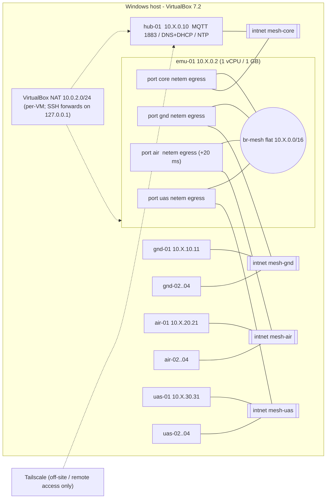

# SDR Lab Network SOP (golden image: ground / air / uas)

| | |
|---|---|
| Status | DRAFT v0.1. The lab emulator and hub VMs were built and tested on 2026-10-05; node VMs are not built yet. |
| Date | 2026-10-05 |
| Scope | Lab network that mirrors a flat MANET (one L2/L3 IP network), the mesh emulator, hub services, and the node config mechanism shared by all SDR-on-Rocky-10 profiles |
| Copies | This is the PUBLIC (scrubbed) copy: addresses generalised to 10.X, unit, vendor, host and personal details removed. |


> **Public copy.** Generated from the private SOP by `scripts/make-public-sop.py`. `10.X` stands for the lab's private second octet. Design unchanged; identifying details removed. Scripts and configs referenced below are not published.

---

## 1. Principles

1. **One flat network.** In the field the MANET radio mesh behaves like one flat L2/L3 IP network, and the lab copies that: one /16 with no routing between roles. Role blocks are an addressing convention, not subnets.
2. **One apply engine.** Every node (ground, air, uas, hub) is configured by the same `lab-netconfig` reading the same `node.conf`. Lab provisioning, the future operator TUI and future field discovery (DHCP options or mDNS) differ only in **who writes node.conf**.
3. **Mesh traffic never depends on Tailscale.** Tailscale is only for off-site and remote access. Nodes run it with `--accept-dns=false --accept-routes=false`, and no node advertises the mesh subnet.
4. **Impairment profiles are lab estimates**, NOT radio vendor specifications.
5. **No secrets in files.** `node.conf` holds a *path* to a Tailscale key file, never a key. Nothing in this folder contains a key, password or token.

## 2. Addressing plan (lab mesh 10.X.0.0/16)

| Block | Purpose | Hosts | Formula |
|---|---|---|---|
| 10.X.0.0/24 | core | .1 reserved (future gateway), .2 `emu-01`, .10 `hub-01` | hub-NN = 10.X.0.(9+NN), NN 1..9 |
| 10.X.10.0/24 | ground | `gnd-NN` | 10.X.10.(10+NN) |
| 10.X.20.0/24 | AIR | `air-NN` | 10.X.20.(20+NN) |
| 10.X.30.0/24 | UAS | `uas-NN` | 10.X.30.(30+NN) |
| 10.X.250.0/24 | reserved: radio management IPs | none | n/a |

* Prefix is **/16 on every host** (flat). Nothing routes between the /24 blocks because they all sit on one segment.
* NODE_ID is 01..99, so ground hosts fall in .11–.109, AIR in .21–.119 and UAS in .31–.129. All stay inside their /24.
* **No default gateway on the mesh.** 10.X.0.1 is reserved. Mesh profiles set `ipv4.never-default yes` unless `GATEWAY` is set, so in the lab the VirtualBox NAT NIC keeps the default route.
* **Why 10.X:** it avoids VirtualBox NAT 10.0.2.0/24, host-only 192.168.56.0/24 (present on this host), Tailscale CGNAT 100.64.0.0/10, and common home LANs (192.168.0/1.x, 10.0.0.0/24, 10.0.1.0/24).

### Planned hosts

| Name | Address | Role | Lab MAC (mesh NIC) |
|---|---|---|---|
| emu-01 | 10.X.0.2 (on br-mesh) | mesh emulator | bridge + 4 ports (planned MACs in the private copy) |
| hub-01 | 10.X.0.10 | MQTT, DNS/DHCP, NTP | `<mac>` |
| gnd-01..04 | 10.X.10.11–14 | ground station (desktop) | `<mac>` |
| air-01..04 | 10.X.20.21–24 | AIR (headless) | `<mac>` |
| uas-01..04 | 10.X.30.31–34 | UAS (headless, slim) | `<mac>` |

MAC scheme: one planned address per role and node (listed in the private copy). The MACs are locally administered and **planned placeholders**: the VirtualBox plan script assigns them to lab VMs, and dnsmasq static leases use them. Replace them with real MACs for bare-metal nodes.

## 3. Naming and DNS

* FQDN `<role>-<nn>.lab.internal`, role prefixes `gnd`, `air`, `uas`, `hub`, `emu`. `.internal` is the reserved private TLD (ICANN, 2024).
* The static hostname is the short name (`air-01`). The FQDN comes from `/etc/hosts` and DNS.
* **Unconfigured images** (no node.conf) keep or get the hostname `lab-<4hex>`, taken from the first 4 hex digits of `/etc/machine-id`. The golden image must ship with an **empty `/etc/machine-id`** so each clone or flash gets a unique ID.
* hub-01 dnsmasq is authoritative for `lab.internal` (A and PTR records for every planned name, plus `mqtt` and `ntp` CNAMEs) and forwards other names to the VirtualBox NAT resolver 10.0.2.3 (**lab only**).
* Each node also gets a managed `/etc/hosts` block (self, hub-01, emu-01), so core names still resolve when DNS is down or the link is cut.

## 4. Topology



Every VM has **NIC1 = NAT** (management and package installs) and its mesh NIC(s) on intnets. Nodes have exactly **one** mesh NIC.

## 5. VirtualBox layout

| VM | vCPU / RAM / disk | NIC1 | Mesh NICs | SSH |
|---|---|---|---|---|
| emu-01 | 1 / 1024 MB / 8 GB | NAT | NIC2 mesh-core, NIC3 mesh-gnd, NIC4 mesh-air, **NIC5 mesh-uas**. All virtio, promiscuous **allow-all** | 127.0.0.1:2225 -> 22 |
| hub-01 | 1 / 2048 MB / 10 GB | NAT | NIC2 mesh-core (promisc deny) | 127.0.0.1:2224 -> 22 |
| gnd-NN | per golden ground profile | NAT | NIC2 mesh-gnd | ProxyJump via hub-01 |
| air-NN | per golden air profile | NAT | NIC2 mesh-air | ProxyJump via hub-01 |
| uas-NN | per golden uas profile | NAT | NIC2 mesh-uas | ProxyJump via hub-01 |

* **NIC count:** emu-01 needs 5 adapters. VirtualBox supports **8 adapters per VM with the PIIX3 chipset and 36 with ICH9** (`VBoxManage list systemproperties` on this host, 7.2.20, reports exactly that). The **GUI only shows adapters 1–4**, so adapter 5 must be configured with `VBoxManage modifyvm --nic5 ...` (see `scripts/vbox/New-LabVMs.ps1`). The expected guest name for adapter 5 on PIIX3 is `enp0s16`. meshctl binds ports by MAC, so the name does not matter.
* **Promiscuous mode:** required, set to allow-all, on the four emu-01 intnet NICs. An intnet acts like a switch and delivers unicast frames only to the NIC that owns the destination MAC. A guest bridge has to receive frames addressed to *other* VMs' MACs, and without promiscuous mode only broadcast traffic gets through: ARP resolves, but unicast ping fails. On an intnet, `allow-vms` would be enough (there is no host side), and `allow-all` behaves the same. Node and hub NICs stay on `deny`.
* SSH forwards bind to **127.0.0.1 only**. At the time of writing, 127.0.0.1:2222 is already in use on the host (VirtualBox process). 2224 and 2225 are free.

## 6. Mesh emulator (emu-01)

### 6.1 Bridge

* `br-mesh`: NM bridge, `bridge.stp no` (single bridge, no loops possible as long as each node has one mesh NIC), `bridge.multicast-snooping no` (so mDNS and future discovery multicast floods to every segment), address 10.X.0.2/16, `never-default`, firewalld zone `lab-mesh`.
* Ports `br-mesh-{core,gnd,air,uas}` are bound by MAC, with GRO/GSO/TSO off (`ethtool.feature-*` in NM, and again in meshctl).
* The bridge profile sets `connection.autoconnect-ports true` (NetworkManager rejects `yes` for this property). The per-NIC profiles the installer creates (enp0s8, enp0s9, ...) are set to `autoconnect no` so they cannot take the NICs from the port profiles at boot; they are kept, not deleted.
* `/etc/sysctl.d/90-meshctl.conf` sets `bridge-nf-call-{iptables,ip6tables,arptables}=0`, so bridged frames bypass the firewall even if `br_netfilter` gets loaded.
* Packages: `iproute-tc`, **`kernel-modules-extra`** (EL10 ships `sch_netem` there, not in the base kernel package), `ethtool`, `iperf3`, `tcpdump`.

### 6.2 Shaping model (read this before interpreting results)

netem plus `rate` runs as the root qdisc on **egress** of each bridge-member port. A frame is shaped by the port it **leaves** emu-01 on, which is the **destination** segment's port:

| Flow | Shaped by |
|---|---|
| gnd-01 -> hub-01 | core port profile |
| hub-01 -> gnd-01 | gnd port profile |
| gnd-01 -> air-01 | air port profile (+20 ms) |
| air-01 -> gnd-01 | gnd port profile |
| gnd-01 -> gnd-02 | **nothing: the frame never reaches emu-01** (see 12.3) |

So both directions of every cross-segment flow are shaped once each. With the same profile on `all` ports, every path gets the profile once per direction. **A profile on a single segment shapes only traffic going *into* that segment**: `meshctl profile contested gnd` makes hub->gnd contested but leaves gnd->hub at the core profile (asymmetric). For symmetric per-segment impairment, set `INGRESS_SHAPING=yes` in meshctl.conf. meshctl then also redirects each port's ingress to an IFB device (`ifb-<seg>`) running the same netem, and every cross-segment direction gets **source + destination** profiles (a "two-hop" model, so halve the profile values if that is the intent). The default stays egress-only, per the approved scheme.

### 6.3 Profiles (LAB ESTIMATES, NOT RADIO SPECS)

Profile files live in `/etc/meshctl/profiles.d/<name>.conf` and are editable. Any new file becomes a usable profile name.

| Profile | One-way delay | Loss | Rate | Other | netem queue (LIMIT) |
|---|---|---|---|---|---|
| good | 10 ms ± 2 ms | 0.1 % | 20 mbit | | 1000 |
| degraded | 60 ms ± 20 ms | 2 % | 5 mbit | | 200 |
| contested | 250 ms ± 100 ms | about 10 %, bursty: Gilbert-Elliott `gemodel 2.8% 25% 100% 0%` (mean burst about 4 packets) | 1 mbit | reorder 1 % | 100 |
| cut | n/a | 100 % | n/a | link stays up (no carrier event), like a radio out of range | 1000 |

* air port: `EXTRA_DELAY_MS_AIR=20` adds +20 ms base delay for range to every profile except cut.
* LIMIT is kept small on slow profiles so queueing delay stays plausible (1000 packets at 1 mbit would be about 12 s of buffer).
* netem caveats: (a) jitter larger than the packet spacing reorders packets by itself, so measured reordering under degraded and contested will exceed the configured 1 %; (b) netem's simple loss correlation (`loss P% C%`) is weak: on EL10 (kernel 6.12) the earlier contested setting `loss 10% 25%` measured only about 1-1.5 % loss. Since 2026-10-05 contested uses the Gilbert-Elliott model instead (`loss gemodel 2.8% 25% 100% 0%`: p = 2.8 % good->bad, r = 25 % bad->good, every packet lost in the bad state and none in the good state; average p/(p+r) about 10 %, mean burst 1/r = 4 packets).
* Profile key `LOSS_GEMODEL` (new 2026-10-05) sets Gilbert-Elliott loss as 1-4 percentages in netem order (p, r, 1-h, 1-k), e.g. `LOSS_GEMODEL="2.8% 25% 100% 0%"`. It can't be combined with `LOSS_PCT`: meshctl rejects a profile that sets both, so leave `LOSS_PCT` and `LOSS_CORR_PCT` empty.
* Measured 2026-10-05, emu-01 -> hub-01 (one shaped hop), n=1000 at 50 pps: contested 10.0-12.1 % loss in bursts (mean burst about 4-6 packets), average RTT about 280 ms (at this packet rate `rate` plus the 100 ms jitter queues packets; about 244 ms at 5 pps). degraded is unchanged and measured about 2 % (1.9-2.1 %).

Resulting commands, for example `meshctl profile contested air` (the air port adds 20 ms; on the other ports it is `delay 250ms 100ms`):
`tc qdisc del dev <air-port> root` (error ignored if there is no qdisc), then
`tc qdisc add dev <air-port> root netem limit 100 delay 270ms 100ms loss gemodel 2.8% 25% 100% 0% reorder 1% rate 1mbit`

* meshctl deletes and re-adds the qdisc instead of using `tc qdisc replace` (fixed 2026-10-05), on the ports and on the IFBs. Replacing netem with netem kept the parameters the new profile leaves unset: after contested -> degraded the port still had the contested loss correlation and `reorder 1%`, and degraded measured 0 % loss instead of 2 %.

### 6.4 meshctl

```
meshctl profile <good|degraded|contested|cut|NAME> [core|gnd|air|uas|all]   # default all
meshctl status        # bridge/port state, current profile per port, tc -s counters
meshctl reset         # remove all shaping (and IFBs)
meshctl list          # profiles with descriptions
meshctl boot          # used by meshctl-default.service
MESHCTL_DRY_RUN=1 meshctl profile degraded all     # print tc commands only
```

* Config: `/etc/meshctl/meshctl.conf` (ports by MAC or name, extra delays, DEFAULT_PROFILE=good, DISABLE_OFFLOADS, INGRESS_SHAPING, BOOT_WAIT_S). Like node.conf, it is parsed with a regex and never sourced.
* State: `/run/meshctl/<seg>` (current profile name; resets on reboot to the default).
* `meshctl-default.service` waits for the ports, applies **good** to all at boot, and removes shaping on stop.

## 7. Hub services (hub-01)

hub-01 is a minimal Rocky 10 VM (1 vCPU, 2 GB) at 10.X.0.10 on mesh-core, with NAT SSH on 127.0.0.1:2224. Its mesh address comes from `lab-netconfig` with `configs/node-conf/hub-hub-01.node.conf` (ROLE=hub), the same engine the nodes use.

### 7.1 MQTT (Mosquitto 2.0.x from EPEL 10; enable CRB first)

* `configs/hub-01/mosquitto.conf`: listeners on **10.X.0.10:1883** (mesh) and **127.0.0.1:1883**, never on the NAT NIC. `allow_anonymous true` is **LAB ONLY**. Persistence is on, with limits sized for 1 mbit links.
* **Release hardening (flagged):** TLS on 8883, plaintext 1883 removed, per-node credentials (client certs or password file), and an ACL limiting each node to `lab/<role>/<own-node>/#`. The conf has a commented-out draft of this.
* systemd drop-in: mosquitto waits for `network-online.target` and restarts on failure, because it binds the mesh address.
* firewalld: `mqtt` allowed only in zone `lab-mesh`.

**Topic scheme:** `lab/<role>/<node>/{status,geo,cmd,stream-req}` (see `configs/mqtt/topics.md`).

| Leaf | QoS | Retain | Purpose |
|---|---|---|---|
| status | 1 | yes | health; also the Last Will (`{"state":"offline"}`) |
| geo | 0 | no | position fixes (drop, don't queue) |
| cmd | 1 | no | commands to a node; idempotent |
| stream-req | 1 | no | ask a node to start/stop a stream (stream not over MQTT) |

**Payloads (PROVISIONAL fields):** `configs/mqtt/geo.example.json`, `configs/mqtt/status.example.json`. Example `geo`:

```json
{"schema":"lab.geo.v0","node":"air-01","role":"air","ts":"2026-10-05T23:30:00.000Z","seq":1842,
 "fix":"3d","lat":40.0,"lon":-105.0,"alt_m_msl":18250.4,"hdop":0.9,"sats":14,
 "speed_mps":6.2,"course_deg":271.5,"climb_mps":4.8,"src":"gps"}
```

Example `status`:

```json
{"schema":"lab.status.v0","node":"air-01","role":"air","ts":"2026-10-05T23:30:00.000Z","seq":512,
 "state":"online","uptime_s":7260,"net":{"iface":"enp0s8","addr":"10.X.20.21/16","mode":"dhcp-fallback-static","path":"dhcp"},
 "time":{"source":"ntp","offset_ms":1.7},"health":{"cpu_temp_c":48.5,"load1":0.42,"mem_free_pct":61,"disk_free_pct":78}}
```

Client defaults (lab): keepalive 30 s, durable session (`clean_session=false`), client ID = hostname.

### 7.2 DNS and DHCP (dnsmasq) - `configs/hub-01/dnsmasq-lab.conf`

* Listens on 10.X.0.10 only (`bind-dynamic`, so it tolerates the address appearing late).
* `host-record` for emu-01, hub-01, gnd/air/uas-01..04 (A and PTR), plus `mqtt` and `ntp` CNAMEs.
* DHCP **static leases only** (`dhcp-range=...,static`) on the /16. Unknown MACs get nothing. Leases carry **no router option**, DNS and NTP = 10.X.0.10, and search domain lab.internal. MACs are the planned placeholders from section 2.
* Upstream for non-lab names is 10.0.2.3 (VirtualBox NAT) - **lab only**.
* Validated on 2026-10-05 with `dnsmasq --test`: syntax OK.

### 7.3 NTP (chrony) - `configs/hub-01/chrony.conf`

* hub-01 syncs from the public pool via NAT (**lab only**), serves `allow 10.X.0.0/16`, and keeps serving with `local stratum 10 orphan` if upstream is lost.
* Nodes point at it through node.conf `NTP=`. **In the field, nodes use GPS time** (gpsd plus a PPS refclock), set up separately from this lab mechanism.

### 7.4 Tailscale

Off-site and remote access only. Mesh services (MQTT, DNS, DHCP, NTP, node-to-node) must work with Tailscale stopped (test TS1). Run it with `--accept-dns=false --accept-routes=false` and never `--advertise-routes=10.X.0.0/16`. 100.64.0.0/10 does not overlap the lab plan.

## 8. Node config mechanism

### 8.1 Files

| Path | Purpose |
|---|---|
| `/boot/efi/lab/node.conf` | **Primary.** On the FAT EFI partition, so it can be edited from Windows after flashing |
| `/etc/lab-node/node.conf` | Fallback (used when the EFI file is absent) |
| `/etc/lab-node/effective.conf` | Written on every run: resolved values + state (`applied`, `invalid`, `unconfigured`). Services (MQTT client, telemetry) read this, not node.conf |
| `/var/lib/lab-node/backup/` | Timestamped copies of every file the engine replaced (0700) |
| `/usr/local/sbin/lab-netconfig` | Apply engine (bash); **0.2.0-draft** also validates non-network node keys (CPU_POWER_CAP_W, WATCHDOG_SEC, STREAM_DEFAULT, RECORD_MAX_PCT) and passes them through to `effective.conf` |
| `/etc/systemd/system/lab-netconfig.service` | Runs every boot |

### 8.2 Format rules

* Shell-style `KEY=value`, one per line, `#` comments, optional matching quotes, and a trailing ` # comment` on unquoted values.
* **Never sourced or eval'd.** Each line is matched with a regex. Values may only contain `A-Z a-z 0-9 . _ : / , @ % + = -` and space, so `$()`, backticks, `;`, `|`, `&`, `<`, `>` and quotes inside values are rejected.
* **Strict whitelist**: unknown keys, duplicate keys and `export` lines are errors.
* Windows-friendly: CRLF line endings and a UTF-8 BOM are tolerated. Max size 16 KB.
* Any error exits with code 2 and the **network is left unchanged (last-known-good)**. The errors go to the journal and to effective.conf (`LAB_STATE=invalid`).

### 8.3 Keys

| Key | Values | Default when empty | Notes |
|---|---|---|---|
| ROLE | ground, air, uas, hub | **required** | |
| NODE_ID | 1..99 (hub 1..9), zero-padding OK | **required** | normalised to 2 digits |
| HOSTNAME | DNS label | `<role>-<nn>` (role prefix `gnd`, `air`, `uas` or `hub`) | lowercased; warning if it differs from plan |
| DOMAIN | FQDN | lab.internal | |
| NET_MODE | static, dhcp, dhcp-fallback-static | ground/hub: static; air/uas: dhcp-fallback-static | |
| IFACE | auto or ifname | auto | auto = first wired NIC that isn't NAT (8.5) |
| ADDRESS | IPv4 (no /len) | derived from ROLE+NODE_ID (section 2) | warning if it differs from plan; in dhcp-fallback-static it is the fallback address |
| PREFIX | 8..30 | 16 | |
| GATEWAY | empty, IPv4, or `auto` (dhcp modes) | empty = mesh never takes the default route | must be inside ADDRESS/PREFIX |
| DNS | up to 3 IPv4, comma/space separated | none | static: used as-is; dhcp: overrides DHCP DNS if set |
| NTP | up to 4 hosts/IPs | none (chrony untouched) | written to `/etc/chrony.d/lab-node.sources` as `server X iburst prefer` |
| MQTT_HOST | IPv4 or DNS name | none | passed through to effective.conf for SDR services |
| TS_AUTHKEY_FILE | absolute path under `/boot/efi/lab/`, `/etc/lab-node/` or `/var/lib/lab-node/` | none | **path only**: any value containing `tskey` is rejected and never logged. The engine never reads the file |
| FALLBACK_TIMEOUT | 5..600 s | 30 | only used by dhcp-fallback-static |
| CPU_POWER_CAP_W | empty, 0, or 3..125 | role default: air 12, uas 8; ground empty = not managed | Non-network (0.2.0+). Intel RAPL package power cap in W. `0` = leave firmware limits. Validated by `lab-netconfig`; applied by other units via `effective.conf` |
| WATCHDOG_SEC | empty, 0, or 10..600 | role default: air/uas 30; ground empty = image default | Non-network (0.2.0+). systemd hardware watchdog timeout in s (`0` = off; needs `/dev/watchdog`) |
| STREAM_DEFAULT | none, sdrpp, rtltcp, soapy | none | Non-network (0.2.0+). Stream started at boot by `lab-node-agent` |
| RECORD_MAX_PCT | 10..95 | 70 | Non-network (0.2.0+). Prune oldest local recordings while the recordings filesystem is above this % used |

### 8.4 What lab-netconfig does

1. Finds node.conf (EFI first, then /etc). If there is none, the image is **unconfigured**: the hostname becomes `lab-<4hex>` if it is currently localhost, the network is not touched, and the state is `unconfigured`.
2. Parses and validates, then derives defaults (HOSTNAME, ADDRESS, NET_MODE ...).
3. Resolves IFACE.
4. Applies with **nmcli** to connection **`mesh`** (and **`mesh-fallback`** for dhcp-fallback-static):
   * At boot NetworkManager is not running yet, so the unit renders keyfiles with **`nmcli --offline`** (NM >= 1.46; Rocky 10 qualifies) into `/etc/NetworkManager/system-connections/`, mode 0600. A file is replaced only if its content changed, with a backup first.
   * On a manual re-run (NM running), it uses `nmcli connection modify` or `add`, then `nmcli connection up`.
   * Other profiles bound to the same NIC get `autoconnect no`, so they cannot steal it.
   * Common properties: `connection.zone lab-mesh`, `ipv6.method link-local`, `ipv4.dns-search <DOMAIN>`, `ipv4.dns-priority 50` (mesh DNS ahead of NAT DNS), `never-default` unless GATEWAY is set.
5. Sets the hostname (`/etc/hostname` + `hostname` at boot, `hostnamectl` online).
6. Rewrites the managed `/etc/hosts` block (`# BEGIN/END lab-netconfig`): self (unless dhcp), plus hub-01 and emu-01 when DOMAIN=lab.internal.
7. Writes the chrony sources file and adds `sourcedir /etc/chrony.d` to chrony.conf once (with a backup). Online, it reloads or restarts chronyd.
8. Writes `/etc/lab-node/effective.conf`.

Options: `--check` (validate and print, any user), `--dry-run` (print every command or file change), `--boot`, `--no-up`, `--config FILE`.

### 8.5 IFACE=auto

The first NIC in natural sort order that has a backing bus device and `type=1` (Ethernet), and is not wireless. This excludes lo, bridges, veth, tun and tailscale0. Also excluded:
* any NIC already holding a 10.0.2.x address (VirtualBox NAT);
* under VirtualBox (`systemd-detect-virt` = oracle), the adapter at PCI `0000:00:03.0`. **Lab convention: NIC1 is always NAT.** The PCI address is matched anywhere in the resolved `/sys/class/net/<if>/device` path, so virtio adapters (`.../0000:00:03.0/virtio0`) are skipped too. Fixed 2026-10-05: before the fix only the path's last component was compared, the virtio NAT NIC was not skipped, and at boot (before the NAT address arrives) the engine bound `mesh` to the NAT NIC and turned off its profile, so nodes came up with no network.

On multi-port bare metal (e.g. embedded SBCs with more than one Ethernet port) the engine logs a warning listing the candidates. **Set IFACE explicitly** to the port cabled to the radio.

### 8.6 NET_MODE behaviour

| Mode | `mesh` | `mesh-fallback` |
|---|---|---|
| static | manual ADDRESS/PREFIX, priority 100 | autoconnect off if present |
| dhcp | DHCP, `may-fail yes` | autoconnect off if present |
| dhcp-fallback-static | DHCP, `ipv4.dhcp-timeout=FALLBACK_TIMEOUT`, `may-fail no`, `autoconnect-retries 1`, priority 100 | manual ADDRESS/PREFIX, priority 50, unlimited retries |

In dhcp-fallback-static, NetworkManager tries `mesh` once. If no lease arrives within FALLBACK_TIMEOUT, the activation fails and NM activates `mesh-fallback`. The dnsmasq static lease and the fallback use **the same address**, so peers see the same IP either way. **The fallback is evaluated at activation time.** Once on `mesh-fallback`, the node does not move back to DHCP by itself; a reboot or `sudo lab-netconfig` re-run switches back. This is deliberate (no address flapping mid-flight) and is covered by test F3.

### 8.7 Boot ordering - `lab-netconfig.service`

`After=local-fs.target` (so /boot/efi is mounted), `Before=network-pre.target NetworkManager.service NetworkManager-wait-online.service network-online.target chronyd.service`, `Wants=network-pre.target`, Type=oneshot, `SuccessExitStatus=2` (an invalid file does not fail the boot), and it runs on **every** boot.

### 8.8 Tailscale key file policy (archive)

* Put the pre-auth key in a file (e.g. `/boot/efi/lab/ts-authkey`) and point `TS_AUTHKEY_FILE` at the file. Never put the key in node.conf.
* A separate join step (future `lab-ts-join`, not part of the network engine; the mesh never waits on it) runs `tailscale up --auth-key=file:<path> --hostname=<HOSTNAME> --accept-dns=false --accept-routes=false`. **After a successful join the key file is archived**: moved off the FAT partition to `/var/lib/lab-node/archive/` (root, 0600) with a timestamp suffix.
* FAT has no per-file permissions (RHEL mounts /boot/efi with umask 0077: root-only in Linux, but anyone who has the drive in hand can read it), so use **one-time, short-expiry, tagged** keys. That way an archived copy is useless.

### 8.9 Future TUI and discovery (contract)

The operator prompt (TUI) and field discovery (DHCP options from the field network, or mDNS on the mesh) **only write node.conf** (same keys, same validation), then run `lab-netconfig` or reboot. The apply engine does not change. `--check` is the shared validator.

### 8.10 Example node.conf files (`configs/node-conf/`)

| File | Role / node | Mode |
|---|---|---|
| ground-gnd-01.node.conf | ground gnd-01 10.X.10.11 | static |
| air-air-01.node.conf | air air-01 10.X.20.21 | dhcp-fallback-static (30 s) |
| uas-uas-01.node.conf | uas uas-01 10.X.30.31 | dhcp-fallback-static (30 s) |
| hub-hub-01.node.conf | hub hub-01 10.X.0.10 | static (NTP empty: hub is the server) |

All four pass `lab-netconfig --check` (verified 2026-10-05).

## 9. VM inventory and build order

| # | VM | Base | Created by | Notes |
|---|---|---|---|---|
| - | `<build-vm>` | n/a | build job | **Do not touch.** Do not start lab work until the build finishes (host contention) |
| - | `<dev-vm>` | n/a | dev VM | **Do not touch** |
| 1 | emu-01 | Rocky 10 minimal ISO | `New-LabVMs.ps1 -Apply` + `emu-setup.sh --apply` | 1 vCPU / 1 GB |
| 2 | hub-01 | Rocky 10 minimal ISO | `New-LabVMs.ps1 -Apply` + `hub-setup.sh --apply` | 1 vCPU / 2 GB |
| 3 | gnd-01, air-01, uas-01 | golden image clones | clone + NIC commands printed by the PS1 + node.conf | one mesh NIC each |
| 4 | gnd/air/uas-02..04 | golden image clones | as above | scale-out after step 3 passes |

Build order:
1. Wait until the golden-image build job is finished.
2. Run `scripts/vbox/New-LabVMs.ps1` (print only) and review the output. Then run it with `-IsoPath <Rocky10.iso> -Apply`. It refuses to touch existing or protected VMs.
3. Install Rocky 10 minimal on emu-01. Copy this folder over and run `sudo ./scripts/emu-01/emu-setup.sh` (dry run), then `--apply`.
4. Install Rocky 10 minimal on hub-01. Run `sudo ./scripts/hub-01/hub-setup.sh`, then `--apply`.
5. Run test T0 (emu-01 <-> hub-01).
6. Clone golden -> gnd-01, air-01, uas-01 (powered off). Set the NICs per the printed commands and drop the matching node.conf into `/boot/efi/lab/`. Boot, then run tests B1, D1, N1.
7. Run the full matrix (section 10).
8. Scale to -02..-04 and repeat T1 with all nodes up.

## 10. Test plan

Record the results in `network-sop/results/<date>-<test>.md` (create the folder when testing starts). Run from gnd-01 unless noted.

### Baseline and boot
| ID | Test | Pass |
|---|---|---|
| T0 | `meshctl reset`; ping emu-01 <-> hub-01; `bridge fdb show br br-mesh` | 0 % loss, RTT < 2 ms; MACs learned on the right ports |
| B1 | Boot each node: `systemctl status lab-netconfig`, `cat /etc/lab-node/effective.conf`, `nmcli -g GENERAL.CONNECTION device show <if>` | STATE=applied, connection `mesh` (or `mesh-fallback` when expected), hostname and IP per plan |
| B2 | Reboot emu-01 | `meshctl status` shows **good** on all ports within 60 s of boot |
| B3 | Unconfigured clone (no node.conf) | hostname `lab-<4hex>`, STATE=unconfigured, no `mesh` profile created |
| D1 | `dig @10.X.0.10 air-01.lab.internal +short`; `dig -x 10.X.20.21 @10.X.0.10` | 10.X.20.21 / air-01.lab.internal |
| D2 | `meshctl profile cut gnd`; `getent hosts hub-01` on gnd-01 | resolves from /etc/hosts block |
| N1 | `chronyc sources -v` on a node | hub-01 selected (`*`), offset < 5 ms under good |

### Per-profile matrix (run for good, degraded, contested, cut with `meshctl profile <p> all`)
| ID | Test | Expected (egress-only model, same profile on all ports) |
|---|---|---|
| P1 | `ping -c 200 -i 0.2 hub-01` | RTT about 20 / 120 / 500 ms (good/degraded/contested; ±jitter); loss about 0.2 % / 4 % / 19 % (≈ 1-(1-p)^2); cut 100 % |
| P2 | `ping -c 200 -i 0.2 air-01` | RTT about 40 / 140 / 520 ms (air +20 ms one way) |
| P3 | iperf3 UDP: `iperf3 -c hub-01 -u -b <0.9 x rate> -t 30` and `-R` | throughput ≈ 0.9 x rate; loss ≈ profile loss (+ any queue overflow) |
| P4 | iperf3 TCP: `iperf3 -c hub-01 -t 30` and `-R` | good ≈ 18–19 Mbit/s. Degraded and contested come out **far below** the rate limit (TCP vs loss and RTT: roughly 1 Mbit/s and under 0.1 Mbit/s). Record as a baseline, not pass/fail |
| P5 | MQTT: `mosquitto_sub -h hub-01 -t 'lab/#' -v` on gnd-01; on air-01 publish status QoS1 at 1 Hz with seq + ts | good/degraded/contested: **no missing seq** (QoS1 over TCP); latency recorded (p50/p95). cut: nothing (see L1) |
| P6 | geo QoS0 at 5 Hz from air-01 | gaps acceptable under contested; no broker backlog growth (`$SYS/broker/messages/stored`) |

MQTT publish loop (on the node):
```bash
i=0; while :; do mosquitto_pub -h 10.X.0.10 -q 1 -t lab/air/air-01/status \
  -m "{\"schema\":\"lab.status.v0\",\"node\":\"air-01\",\"seq\":$i,\"ts\":\"$(date -u +%FT%T.%3NZ)\"}"; i=$((i+1)); sleep 1; done
```

### Asymmetry and segment checks
| ID | Test | Expected |
|---|---|---|
| A1 | `meshctl profile good all; meshctl profile contested gnd`; ping hub-01 from gnd-01 | RTT ≈ 10 + 250 ms: only hub->gnd is contested (documents the egress model) |
| A2 | Same with `INGRESS_SHAPING=yes` | both directions contested: RTT ≈ 520 ms (each direction 250 ms contested + 10 ms good) |
| A3 | gnd-01 <-> gnd-02 ping under `contested all` | **unshaped** (< 2 ms): same-intnet traffic bypasses emu-01 (known limitation, 12.3) |

### Link cut and recovery
| ID | Test | Pass |
|---|---|---|
| L1 | air-01 connected to MQTT with a Last Will; `meshctl profile cut air` for 120 s | hub-01 sees retained `lab/air/air-01/status` = offline within about 1.5 x keepalive (≈ 45 s); gnd nodes are unaffected |
| L2 | During the cut, gnd-01 publishes QoS1 to `lab/air/air-01/cmd`; then `meshctl profile good air` | air-01 reconnects within ≤ 30 s, receives the queued cmd (durable session), status goes back to online; ping recovers with no stale ARP (< 5 s) |
| L3 | Cut core (`meshctl profile cut core`) | nodes lose hub services; node<->node across segments still works (flat mesh without the hub) |

### dhcp-fallback-static
| ID | Test | Pass |
|---|---|---|
| F1 | dnsmasq up, `good all`, reboot air-01 | `mesh` active, 10.X.20.21 via DHCP (`journalctl -u dnsmasq` shows DHCPACK for `<mac>`) |
| F2 | `meshctl profile cut air` (or stop dnsmasq), reboot air-01 | after about FALLBACK_TIMEOUT (30 s), `mesh-fallback` is active with 10.X.20.21/16; boot is delayed by about 30 s |
| F3 | Restore, then `sudo lab-netconfig` on air-01 (or reboot) | back on `mesh` (DHCP), same IP |
| F4 | `contested all`, reboot air-01 | record whether DHCP wins within 30 s; either outcome gives 10.X.20.21 |
| F5 | Change the air-01 NIC MAC (no lease) | fallback after 30 s; dnsmasq logs "no address available" |

### Validation (lab-netconfig --check; run on any Linux box)
| ID | Input | Pass |
|---|---|---|
| V1 | unknown key, duplicate key, `export` line | exit 2, specific error |
| V2 | `HOSTNAME=$(reboot)`, backticks, `;` | exit 2 "disallowed characters"; nothing executed |
| V3 | CRLF + BOM file saved by Notepad | exit 0 |
| V4 | `TS_AUTHKEY_FILE=tskey-...` | exit 2, the value is not echoed anywhere |
| V5 | ADDRESS 10.X.10.300 / 10.X.010.11, GATEWAY outside the prefix, NODE_ID 0 | exit 2 |
| V6 | ROLE+NODE_ID only | derived hostname, address and mode are correct |
| V7 | invalid node.conf at boot | the node keeps its previous network; effective.conf STATE=invalid |

V1–V6 were run on 2026-10-05 against the draft and all pass (dry-run on a non-Rocky Linux box with a stub nmcli; no real network changed).

### Independence
| ID | Test | Pass |
|---|---|---|
| TS1 | `tailscale down` (or not installed) on all nodes; disconnect NAT NICs (`setlinkstate1 off`, lab VMs only) | P1, P5, D1, N1 (orphan) still pass |

## 11. Lab-only items (must change at release hardening)

| Item | Lab | Release |
|---|---|---|
| MQTT | anonymous, plaintext 1883 | TLS 8883, per-node certs/credentials, topic ACL, 1883 closed |
| DNS upstream | dnsmasq -> 10.0.2.3 (VirtualBox NAT) | none or field resolver; `no-resolv` only |
| NTP | hub-01 -> public pool via NAT, orphan stratum 10 | GPS + PPS on nodes; hub not authoritative |
| Address plan | 10.X.0.0/16, `LAB_NET=10.X` constant in lab-netconfig | field plan agreed with the radio network; constant moved to config |
| DHCP | static leases with placeholder MACs, no auth | real MACs; consider no DHCP in the field (rogue DHCP risk) |
| NAT NICs | NIC1 on every VM; IFACE=auto skips PCI 00:03.0 | no NAT; IFACE set explicitly on multi-port boards |
| firewalld zone | `lab-mesh` allows ssh, mdns, iperf3 5201 | drop iperf3; SSH keys only; review mdns |
| /etc/hosts | lab core entries (hub-01, emu-01) | field core entries or none |
| Tailscale | key file on FAT, archived after join | one-time tagged keys; policy review (archive vs delete) |
| node.conf integrity | plain text, no signature | consider a signed/checksummed node.conf or a read-only lock after provisioning |
| Emulator | emu-01, meshctl, promiscuous intnets | not shipped in any image |
| Machine identity | must ship an empty `/etc/machine-id` | same; also regenerate SSH host keys on first boot |

## 12. Design issues and decisions

1. **Promiscuous mode is required** on emu-01's four intnet NICs (allow-all; allow-vms would do). Without it the bridge passes only broadcast, so ARP works and unicast fails. Node NICs stay on deny.
2. **NIC count:** emu-01 needs 5 NICs. PIIX3 supports 8 per VM and ICH9 supports 36, but **the GUI only shows 4**. Adapter 5 (mesh-uas) must be set with VBoxManage, and a later look at the VM in the GUI will not show it. Do not "fix" the VM from the GUI without checking `VBoxManage showvminfo emu-01 --machinereadable`.
3. **Same-segment traffic is not shaped.** gnd-01 <-> gnd-02 (or air-01 <-> air-02) is switched inside the VirtualBox intnet and never reaches emu-01. If intra-role links matter (AIR-to-AIR relay, UAS swarm), give each node its own intnet (`mesh-air-01`, ...) and add a port to br-mesh per node. That means switching emu-01 to **ICH9** (up to 36 NICs; 14 planned nodes + core fits) and adding per-node port entries to meshctl. Deferred.
4. **Egress-only shaping is asymmetric for single-segment profiles** (6.2). It is fine for `all`. Optional `INGRESS_SHAPING=yes` (IFB) is implemented, default off. Decision needed: keep it off (as approved) or make it the default with halved per-hop values.
5. **netem lives in `kernel-modules-extra`** on EL10. A minimal install has no `sch_netem`, and meshctl fails with "Unknown qdisc". emu-setup.sh installs the package.
6. **Offloads:** GRO on the emu ports merges packets into 64 KB super-frames, which skews netem loss and rate. meshctl and the NM port profiles disable GRO/GSO/TSO.
7. **Fallback does not fail back live** (8.6). Recovery to DHCP needs a reboot or a re-run. This is intended.
8. **DNS priority:** mesh DNS (priority 50) is tried before NAT DNS. Under `cut`, internet lookups on lab nodes wait for the hub timeout before trying 10.0.2.3. This is lab-only behaviour and acceptable.
9. **Windows-edited node.conf:** CRLF and BOM are handled. Notepad's "Save as UTF-16" is **not** handled (the file is rejected as invalid, last-known-good kept). Use UTF-8.
10. **MAC plan vs VirtualBox:** the planned MACs are locally administered (02:...). VirtualBox accepts them. Clones made in the GUI get random MACs unless set with `--mac-address2`, and then dhcp-mode tests get no lease (that is test F5, but unintended otherwise).

## 13. Files

See `README.md` in this folder for the full file list.
